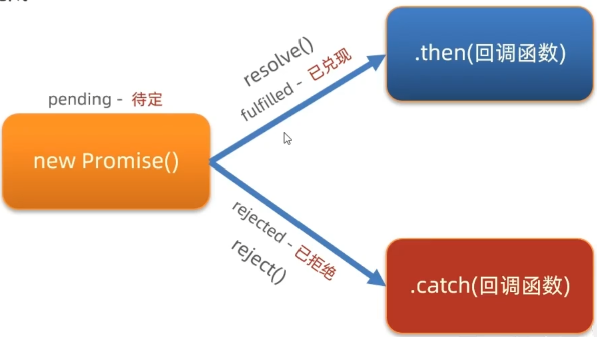

## I.初步认识
- 通过AJAX可以在浏览器中向服务器发送异步请求，可以无刷新获取数据
- 本质上是使用XMLHttpRequest对象与服务器进行通信
### axios
- 基于XMLHttpRequest封装，用于与服务器通信
- axios库地址：`https://cdn.jsdelivr.net/npm/axios/dist/axios.min.js`


#### 使用
  ```js
  axios({
    url:'目标资源地址',
    method:'请求方法'
    /* params:{
      参数名:'值'
    } *///GET请求参数

    /* data:{
      参数名:'值'
    } *///POST提交数据
  }).then(result=>{
    //对服务器返回的数据进行后续处理
  }).catch(error=>{
    //错误处理
  })
  ```

#### form-serialize插件
- 快速收集表单元素
```js
const data=serialize(form,{hash:true,empty:true});
//hash 设置获取数据结构
// - true：JS对象
//empty 设置是否获取空值
```
- 返回一个对象，成员变量即为表单项内容
- 表单元素设置name属性，值会作为对象的属性名
---

**图片上传**  
- 使用FormData对象
```js
document.querySelector('.upload').addEventListener('change',e =>{
  const fd = new FormData()
  fd.append('img',e.target.files[0]);
  axios({
    url: '...',
    method:'...',
    data: fd
  });
})

```

## II.AJAX原理

### XMLHttpRequest

```js
const xhr = new XMLHttpRequest();
xhr.open('请求方法'，'URL网址');
xhr.addEventListener('loadend',()=>{
  //响应结果
  console.log(xhr.response);
});
xhr.send();//发送请求
```

**数据提交**  
- 需要设置请求头

```js
const xhr = new XMLHttpRequest();
//告知服务器内容类型为JSON  
xhr.setRequestHeader('Content-Type'，'application/json');
xhr.open('POST'，'URL网址');
xhr.addEventListener('loadend',()=>{
  //响应结果
  console.log(xhr.response);
});
xhr.send(obj);//发送请求
```

## III.Promise
- Promise对象用于表示一个异步操作的最终完成(或失败)及其结果值

```js
const p = new Promise((resolve,reject)=>{
  setTimeout(()=>{
    //resolve('异步成功')
    reject(new Error('异步失败'))
  },2000)
})
//获取结果
p.then(result=>{
  console.log(result)
}).catch(error=>{
  console.log(error)
})
```

### 三种状态
- 状态一旦被兑现或拒绝则不可再改变


### Promise-链式调用
- 依靠then()方法会返回一个新生成的Promise对象特性，继续串联下一环任务，直到结束
- then()回调函数中的返回值，会影响新生成的Promise对象最终状态和结果
- 通过链式调用可以解决回调函数嵌套问题

```js
const p = new Promise((reslove,reject)=>{
  setTimeout(()=>{
    reslove('北京')
  },200)
})

const p2 = p.then(result=>{
  return new Promise((reslove,reject)=>{
    setTimeout(()=>{
      resolve(result + 'xxx区')
  },200)
  })
})

p2.then(...)
```

### Promise.all()
- 当所有promise对象兑现执行then，否则catch
- result为一个数组，对应Promise对象的结果
```js
const p = Promise.all([Promise1,Promise2...])
p.then(...).catch(...)
```

## IV.async与await

- async用于声明函数，asynv函数是AsyncFunction构造函数的实例，并且其中允许使用`await`关键字
- `async`和`await`使得可以以一种更简洁的方式写出基于Promise的异步行为，而无需刻意链式调用promise

```js
async function getData(){
  const pObj = await axios({url:'xxx'})
  //await取代then函数 
}
```

- 错误捕获使用`try...catch`

## axios请求拦截器
- 在发起请求前，触发的配置函数，对请求参数进行而外配置
- 相当于为所有请求配置公共设置
```js
//例如为请求添加token
axios.interceptors.request.use(function (config){
  const token = location.getItem('token')
  token && config.headers.Authorization = `Bearer ${token}`
  return config
},function(error){
  ...
  return Promise.reject(error)
})
```
