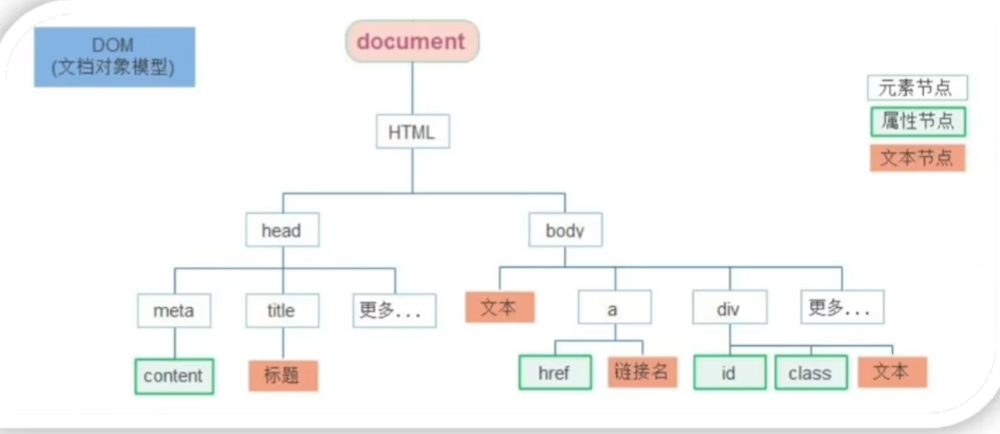
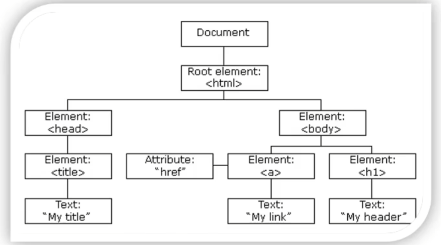
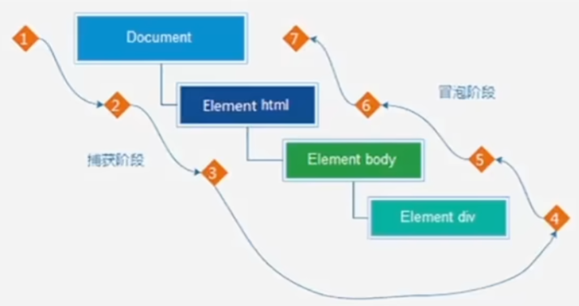
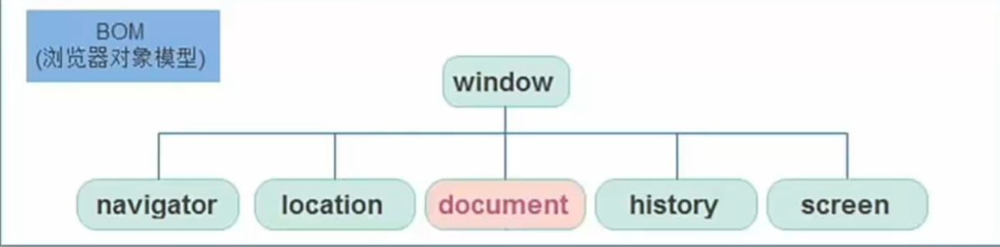
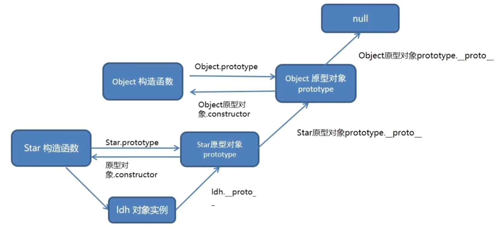

## I.部分基础语句

#### 输出
1. document.write('') 文档输出内容
2. console.log('') 控制台输出内容
3. alert('') 对话框弹出
#### 输入
1. prompt ('')  输入框弹出

#### 模板字符串
用于在字符串中使用变量
使用反引号 `,${}框住变量

```js
let age=18;
document.wirte(`我今年${age}岁`);
//结果:我今年18岁
```

#### 检测数据类型
```typeof x```
返回数据类型

#### 函数声明
```function name(){}```

**动态参数**  
```js
function getSum(){
  //arguments 动态参数 只存在于 函数里面
  let sum=0;
  for(let p of arguments){
    sum+=p;
  }
  return sum;
}
console.log(getSum(2,3,4));
```

**剩余参数**  
- 与动态参数的区别在于可以指定特定参数，再取多余参数作为剩余参数
- 剩余参数得到的为真数组，动态参数为伪数组
```js
function getSum(a,b,...arr){
  //...参数名 剩余参数
  let sum=0;
  for(let p of arr){
    sum+=p;
  }
  return sum;
}
console.log(getSum(2,3,4));
```

#### 立即执行函数
```(function(形参){})(实参)```


#### for in & for of
```js
for(let p in list){
  ...
}//for in用于获取数组中对象的属性(索引)，如对DOM对象集合进行遍历则得到的是string类型的属性名
///////////////////////
for(let p of list){
  ...
}//for of用于遍历对象的值，如对DOM对象集合进行遍历则得到的是个体对象，可对其属性值进行操作
```

#### 间歇函数
```js
let n = setIneterval(function,time)
//每隔time(ms)调用一次function
//返回值为定时器的id
clearInterval(n)//关闭id为n的定时器
```

#### 对象
```js
    let obj={
        name:' ',
        ...
        //方法
        fname:function(){
            ...
        }
    }

```

- 通过构造函数创建对象(类似类)

```js
//类名必须大写字母开头
function People(name,sex,age){
  this.name=name;
  this.sex=sex;
  this.age=age;
}

const a=new People(aaa,b,11)
const b=new People(aac,a,12)
```

---

## II.DOM
- 文档对象模型
- 用于呈现以及与任意HTML或XML文档交互的API


#### DOM树
- 将HTML文档以树状结构直观的表现出来，称之为文档树或DOM树
- DOM树直观的体现了标签与标签之间的关系




#### DOM对象
- 浏览器会根据HTML标签生成JS对象
- 修改这个对象的属性会自动映射到标签身上
- 核心思想：把网页内容当对象来处理 



**document对象**  
- 是DOM里提供的一个对象
- 它提供的属性与方法用于操作网页内容
  - 例如document.wirte()
- 网页所有内容都在document内

**获取DOM元素**  
- 根据CSS选择器来获取
  ```js
  document.querySeltector('css选择器')
  //默认选择匹配的第一个
  //querySeltectorAll匹配多个
  ```

**修改DOM元素**  
- .innerText属性,不解析标签
- .innerHTML属性,解析标签

**操作元素属性**
- `对象.属性` 如 `pic.src=url`
- 修改属性样式`对象.style.属性=`
- 多组单词采用驼峰命名法
- 通过类名来修改
  - `元素.className='类名'`
    - 如给轮播图添加active类样式
    - 这样可以做到js配合css轻松为元素切换、修改多个样式
  - `元素.classList` 解决className覆盖类名的问题
    ```js
    ~.add('类名') //追加类
    ~.remove('类名') //删除类
    ~.toggle('类名') //切换类，有则删，无则加
    ```

**自定义属性**  
- 标签上一律以`data-`开头
- 在DOM对象上一律以`dataset`对象方式获取

### DOM节点
- DOM树的每一个节点称为DOM节点

#### 查找
- 通过关系查找元素

|属性|说明|
|-|-|
|.parentNode|获取父节点对象|
|.children|获取子节点对象|
|.previousElementSibling|获取上一个兄弟节点对象|
|.nextElementSibling|获取下一个兄弟节点对象|


#### 增加

**创建节点**  
```js
document.createElement('标签名');
```

**追加节点**  
```js
//在父元素最后插入
父元素.appendChild(要插入的元素);
//在某个元素前插入
父元素.insertBefore(要插入的元素，在哪个元素之前);
```

#### 克隆
```js
元素.cloneNode(bool);
```
- bool默认false，false不克隆孙子及以后的节点

#### 删除
```js
父元素.removeChild(要删除的元素);
```

- 在JS原生DOM操作中，要删除元素必须通过父元素删除
- 如果不存在父元素则删除不成功
- 删除节点和隐藏节点(display:none)有区别，隐藏节点还是存在，但是删除，则从html中删除节点

---

## III.事件


### 事件监听  
- 监听控件事件以触发函数

```js
元素对象.addEventListener('事件类型',要执行的函数);
```

|事件类型|描述|
|-|-|
|click|点击|
|mouseenter|鼠标经过(无冒泡|
|mouseleave|鼠标离开(无冒泡|
|focus|获得焦点|
|blur|失去焦点|
|Keydown|键盘按下|
|Keyup|键盘抬起|
|input|用户输入|


### 事件对象
- 存储着事件触发时的相关信息
```js
event.addEventListener('click',function(e){
  ...
  
});
//e就为事件对象 ，回调函数的第一个参数
```

**常用属性**  
|属性|描述|
|-|-|
|type|获取当前数据类型|
|clientX/Y|获取光标相对于浏览器可见窗口左上角的位置|
|offsetX/Y|获取光标相对于当前DOM元素左上角的位置|
|key|用户按下的键盘的值|

**阻止默认行为(中断事件)**  
```js
e.preventDefault()
//e为事件对象
```


### 环境对象
- 相当于对象方法函数中指向对象本身的this指针


### 事件流
- 事件完整执行过程中的流动路径


- 冒泡阶段同名事件会依次触发

**阻止** 
- 阻断事件流动传播 
```js
事件对象.stopPropagation()
```

**事件解绑**  
```js
对象.removeEventListener(事件类型,事件处理函数,[获取捕获或冒泡阶段])
```

### 事件委托
- 减少注册次数，提高性能
- 原理：利用冒泡特性 
  - 给父元素注册事件，当触发子元素事件时会冒泡到父元素从而触发父元素事件
  - 在事件对象中target包含触发的子元素信息
  - target的tagName属性为标签名


### 页面加载事件
- 加载外部资源(如图片、外联CSS和JavaScript等)加载完毕时触发的事件
- 监听页面所有资源加载完毕：
  - 给window添加load事件
- load事件也可以针对某个资源进行绑定

**DOMContentLoaded**  
- 当初始的HTML文档被完全加载时触发，无需等待样式表、图像等完全加载
- 监听页面DOM加载完成：
  - 给document添加DOMContentLoaded事件


### 页面滚动事件
- 滚动条在滚动的时候持续触发的事件
- 监听整个页面滚动
  - 给window/ducoment添加scroll事件
- 通过scrollTop、scrollLeft获取滚动位置

### 页面尺寸事件
- 会在窗口改变时触发：
  - resize
- `e.pageX`可以获取光标的坐标

**获取元素宽高**  
- clientWidth、clientHeight
- 不包含边框、margin、滚动条

**offset**  
- 获取宽高，包含padding和border
- offsetWidth、offsetHeight
- 只读
- 获取的距离为距父级左上角

**getBoundingClientRect()**

- 元素.getBoundingClientRect()可以获取DOM元素坐标，配合事件.pageX可以获取光标在DOM元素中的坐标
- 这样可以避免是用offsetX/Y获取鼠标坐标移动其他DOM元素时主DOM元素被覆盖而导致的offsetX/Y突然清零情况

## IV.日期对象
- 可以得到当前系统时间

```js
//得到当前时间
const date = new Date();
//指定时间
const date1 = new Date('2022-1-1 08:30:00');
```


**方法函数**  


### 时间戳
- 1970年1月1日0点到现在经过的ms
- 长于用计算倒计时
- 通过Date的getTime方法获取

## V.window对象

### BOM
- 浏览器对象模型



- 所有通过var定义的变量都会挂在window对象属性下，故var定义的变量能全局使用

### 延时函数
- 让代码延迟执行的函数

```js
setTimeout(回调函数,等待时间ms);
```

**清除**  
- clearTimeout(timer)


### location
- location的数据类型是对象，它拆分并保存了URL地址的各个组成部分
  
**常用属性和方法**  
|名称|类型|描述|
|-|-|-|
|search|属性|获取地址中携带的参数，符号？后面的部分|
|hash|属性|获取地址中的哈希值，符号#后面的部分|
|reload(bool)|方法|刷新页面，true代表强制刷新，默认false|


### navigator
- 数据类型是对象，该对象记录了浏览器自身的相关信息

**常用属性和方法**  
|名称|类型|描述|
|-|-|-|
|userAgent|属性|浏览器版本、平台信息|

### history
- 数据类型为对象，主要管理历史记录，该对象与浏览器地址栏的操作相对应，如前进、后退、历史记录等

**常用属性和方法**  
|名称|类型|描述|
|-|-|-|
|back()|方法|后退功能|
|forward()|方法|前进功能|
|go(参数)|方法|前进后退功能，参数为前进页面数(-1为后退)


## VI.本地存储
- 数据存储在浏览器中
- 设置、读取方便，页面刷新不会丢失数据
- 容量较大，sessioStorage和localStorage约5M左右

### localStorage & sessionStorage
- 可以将数据永久存储在本地(用户电脑)
- 特性：
  - 可以多窗口共享
  - 以键值对的形象存储使用
  - 只能存储字符串

```js
//存储数据
localStorage.setItem(key,value);

//获取数据
localStorage.getItem(key);

//删除数据
localStorage.removeItem(key);

```

**sessionStorage**  
- 生命周期为关闭浏览器
- 在同一窗口下数据可以共享
- 用法跟localStorage基本相同

**由于存储只能为字符串，故存复杂数据类型如对象需使用`JSON.stringfy()`函数转化为字符串，用JSON.parse()进行反编译**

## VII.map与join数组方法

### map
- 可以遍历数组处理数据并返回一个新的数组

```js
数组.map(function(ele,index){
  return 修改后元素
});
```

### join
- 将数组中所有元素转化为一个字符串

```js
数组.join('指定分隔符');
```

## VIII.箭头函数
- 引用箭头函数的目的是更简短的函数写法并且不绑定this，箭头函数的语法比函数表达式更简洁
- 箭头函数适用于那些本来需要试用匿名函数的地方

```js
const fn = (x) => {
  console.log(x);
}
fn(x);
```
- 只有一个参数时可以省略小括号
- 只有一行代码时可以省略大括号


- 可以直接返回一个对象
```js
const fn = (name) => ({username:name})
console.log(fn('zwr'))
```

### 箭头函数的this
- 箭头函数不会创建自己的this，而是沿用自己作用域链的上一层的this
```js
let obj = {
  uname : 'zzz'
  sayHi: () => {
    console.log(this);
  }
}
obj.sayHi();
//结果this指向window
//因为箭头函数上一层作用域为obj，而obj的this指向window
```

## IX.原型
- js规定，每一个构造函数都有一个prototype属性，指向另一个对象，称为原型对象
- 这个对象可以挂载函数，对象实例化不会多次创建原型上函数，节约内存

```js
function People(name,age){
  this.name=name;
  this.age=age;
}
People.prototype.eat = function(){
  console.log('吃');
}


```

### constructor
- 原型对象的属性，指向该原型对象的构造函数

```js
function People(name,age){
  this.name=name;
  this.age=age;
}
/* People.prototype.eat = function(){
  console.log('吃');
} */

People.prototype = {
  //因为赋值操作覆盖了原理的内容，需要重新指向构造函数
  constructor: People, 
  eat: function() {
    console.log('吃');
  }
  ...
}

```

### 对象原型
- 对象都会有一个属性`__proto__`指向构造函数的原型对象
- `[[prototype]]`同义


### 继承
- 通过原型来继承

```js
function People() {
  head: 1,
  eyes: 2
}
function Man(){

}
//使用new是为了给子类Man分出一个单独的原型对象，
//给子类自由扩展而不影响其他兄弟原型
Man.prototype=new People();
Man.prototype.construct=Man;
```

### 原型链
- 基于原型对象的继承使得不同构造函数的原型对象关联在一起，并且这种关联的关系是一种链状结构，我们将原型对像的链状结构关系称为原型链
- __proto__对象原型的意义在于为对象成员查找机制提供一个方向


## X.改变this方法

### call
`fun.call(thisStr,arg1,arg2...)`
- 调用函数,同时可以  改变被调用函数this指向

```js
const obj ={}

function fn(){
  ...
}

fn.call(obj);

```

### apply
`fun.apply(thisStr,[argArray])`
- 同call，主要区别在于函数参数需要以数组形式传入

### bind
`fun.bind(thisStr,arg1,arg2..)`
- 该方法不会调用函数，但是能改变函数内部this指向
- 可以用于修改延迟函数中的this，以达到不使用箭头函数便可使用外层this
```js
//制作一个按钮，在按下后需等待2s后才能再次点击
const btn = document.querySelector('button');
btd.addEventListener('click',function{
  this.disabled =true;
  setTimeout(function(){
    this.disabled = false;
  }.bind(this,2000);
});
```

## XI.防抖节流

### 防抖
- 单位时间内，频繁触发事件，只执行最后一次
- 核心是利用定时器setTimeout实现
  - 每当事件触发时先判断是否存在针对该事件的定时器，有则清除
  - 若没有则存到变量中
  - 在定时器中调用要执行的函数

```js
function debounce(fun,t){
  let timerId=null;
  return function(){
    if(timerId) clearTimeout(timerId);//利用了闭包
    timerId = setTimeout(function(){
      fun();
    },t);
  }
}

box.addEventListener('click',debounce(fun,500));
```

### 节流
- 单位时间内，频繁触发事件，只执行一次
- 与防抖不同的是，节流保证第一次事件能完整执行，在此期间取消其他所有相同事件触发，直到第一次事件执行完
- 实现其实就是防抖基础上不删除定时器，定时器为null时才进行事件触发的函数
```js
function throttle(fun,t){
  let timerId=null;
  return function(){
    if(!timerId){
      timerId = setTimeout(function(){
        fun();
        timerId=null;
      },t);
    }
  }
}

box.addEventListener('click',throttle(fun,500));
```

## XII.ES6-模块化
- 将一个大的程序文件拆分成许多小文件，然后将小文件组合
- 优点
  - 防止命名冲突
  - 代码复用
  - 高维护性

### 语法
- `export`: 用于规定模块的对外接口
- `import`: 用于输入其他模块提供的功能

```js
//m1.js
export let a='123'
export function b(){
  ...
}
```

```html
<script type="module">
  
  //引入m1.js中的所有暴露元素
  import * as m1 from "./src/js/m1.js"
  console.log(m1)
  //m1中包含所有暴露元素
</script>
```

**统一暴露**  
`export {a,b}`

**默认暴露**  
```js
export default {
  a: '123',
  b: function(){
    ...
  }
} 
```

**导入-解构赋值**  
```html
<script type="module">
  import {a,b} from "./src/js/m1.js"
  import {a as c} from "./src/js/m2.js"
  //as取别名防止命名冲突
</script>

```

**模块引入**  
app.js
```js
import * as m1 from "./m1.js"
import * as m2 from "./m1.js"
```

index.html
```html
<script src="./scr/js/app.js" type="module"></script>
```